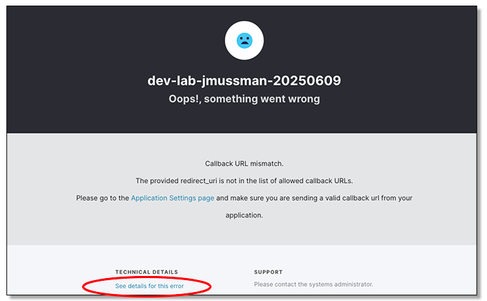

# Lab 1: Application Integration with the Auth0 SDK

[**Table of Contents**](./appdev-workspace.md)

## Synopsis

This lab goes through the steps of integrating an application with Auth0 for authentication and authorization.
This project chooses to use NodeJS as the platform to run a JavaScript web service.
Experienced programmers will have a low learning curve to switch to JavaScript, and it
will be necessary to use JavaScript for the single-page applications anyway.
*Express* is chosen as the embedded web server framework to process HTTP requests in NodeJS.
Express is similar to Flask or FastAPI in Python, Spring in Java, or Kestrel (part of ASP.NET Core) in .NET.
Along the way the features of the Auth0 express-openid-connect SDK will be explored;
the basic functionality of Auth0 Web Application SDKs is similar across all the platforms.

## Setting Up the Lab

1. Verify the *Explorer panel* is displayed.
The first icon in the toolbar is the *Explorer* icon
,
click this to show and hide the *Explorer* panel.
Ctrl/cmd+shift+E is the keyboard shortcut to open the Explorer panel.

1. Expand the *Module 01/src* directory.
Right-click the *app.js* file and select *Open to the Side*.
VS Code will split the editor panel and show these instructions on the left, and the app.js file on the right.

1. Open the lower panel with a terminal window using the
*View &rarr; Terminal* or *Terminal &rarr; New Terminal* menu items.
This panel also contains the *Problems, Output, Debug Console, Ports,* and *Comments* tabs.

1. In the terminal window, change directory to the "Module 01" folder and run the *Node Package Manager* command to install the project dependencies ($ is the prompt).
Do not worry about any warnings from *npm*:
    ```
    $ cd "Module 01"
    $ npm install
    ```


1. If you want a little more room to work in the editor, click the Explorer icon on the toolbar to close that panel.
This should be a satisfactory working environment if your display supports 1920x1080 (regular HD) or higher.

## Registering the Auth0 Application

1. In your browser open the dashboard for your Auth0 tenant.
If it is already open, just go to that tab.

1. In the *Navigation Sidebar* at the left of the dashboard choose *Applications &rarr; Applications*.

1. Click the large blue button that says *+ Create Application*.

1. Call the application *ACME Financial Services*, click on *Regular Web Applications*
for the application type, and click the blue *Create* button.

1. On the application configuration page click the *Settings* tab.

1. Back VS Code lick on the tab for app.js (new files open in the same
editor pane as the file with the focus).

1. In the Explorer panel (open it temporarily if you have to) click *Module 01/.env* file.
This file has externalized configuration variables.
Configuration should not be hardwired into the application, that would require
modifications and rebuilding for each deployment.
The application can read the configuration from this file.

1. Set the ISSUER_BASE_URL property to *https://* plus the value of the application
DOMAIN from the Auth0 tenant.
It will look something like this, but with a different domain name:
    ```
    ISSUER_BASE_URL=https://dev-lab-jmussman-20250506.us.auth0.com
    ```

1. Copy the values from the application configuration at Auth0 and set the
corresponding properties in the .env file:
    ```
    CLIENT_ID=
    CLIENT_SECRET=
    SECRET=a long, randomly-generated string stored in env
    PORT=37500
    ```
    SESSION_SECRET is used by the *express-session* package (express middleware) to
    encrypt session data that is stored as the session key in the user browser.
    It really does not matter what the value is, just that we externalize it so we can
    randomly change the value whenever we want.

    The TCP/IP PORT number is also externalized so, it can be changed if necessary.
    This is where the application listens on the local host for connections; the public port on the Internet could be something else mapped by a router/firewall.

1. Save the file.
Note, we are not quite done yet because we need to configure the *callback* and
*logout* URLs on the Auth0 side.
But we probably do not have them yet!

## Integrating Authentication into the Express Application

1. This application is based on the *Express* framework.
Express is an embedded web server (the application serves itself)
where a chain of middleware functions are used

1. In the terminal window add the *Auth0 Express SDK epxress-oopenid-connect* package
to the project with the following
*npm* command:
    ```bash
    $ npm install express-openid-connect
    ```

1. Add the *dotenv* package to handle externalizing the application configuration:
    ```bash
    $ npm install dotenv
    ```

1. NodeJS packages are downloaded and installed to the *node_modules* folder in the project.
They must be referenced by the application code to use them.
To reference the SDK add the import statement to load *auth* to the list at the top of the
file with the other import statements:
    ```js
    import auth0Express from 'express-openid-connect'
    ```

1. If you are wondering about semicolons in the JavaScript code, technically JavaScript
does not use them (they are ignored).
Many folks still use them as a hangover from C, C++, Java, or C# and you can use them if you like.
This example is following accepted conventions and not including them.

1. *express-openid-connect* is built as a *CommonJS* module so, we have to destructure it
into the components that we need with this statement.
Put it right after the imports:
    ```js
    { auth, requireAuthentcation } = auth0Express
    ```

1. To reference the dotenv module add the following import statement with the others:
    ```js
    import dotenv from 'dotenv'
    ```

1. This application chooses to externalize the configuration values for the connection
to Auth0 in the .env file.
Retrieving the values from the .env file is handled by calling *config* from the *dotenv*
module, so add this statement after deconstructing auth0Express:
    ```js
    dotenv.config()
    ```

1. The Auth0 client object will need the URL to the application.
The code is already in the source.
It checks to see if the application is local or in a GitHub Codespace and builds the
environment variable BASE_URL accordingly.
It also allows a manual override in the .env file.
Don't change anything in the code, this is just for your reference:
    ```js
    if (!process.env.BASE_URL) {
        process.env.BASE_URL = !process.env.CODESPACE_NAME
            ? `http://localhost:${process.env.PORT}`
            : `https://${process.env.CODESPACE_NAME}-${process.env.PORT}.${process.env.GITHUB_CODESPACES_PORT_FORWARDING_DOMAIN}`
    }
    ```

1. There is a bunch of setup for *Express* following that code that is outside our scope.
A redirect is set up if the request landed here with the wrong URL,
the *Pug* view engine is configured for rendering HTML views with the path to the files, 
middleware components are registered to handle JSON and form processing from requests,
static files are served from the project *public* folder,
and session cookies are enabled and encrypted with the *SECRET* in the .env file.

1. The Auth0 client object is a middleware function that must be registered with express.
The function is generated by calling the *auth* function from the *express-openid-connect* sdk.
Add this code following the session setup to create it and register the client in one statement:
    ```js
    app.use(
        auth({
            // issuerBaseURL: process.env.ISSUER_BASE_URL,
            // baseURL: process.env.BASE_URL,
            // clientID: process.env.CLIENT_ID,
            clientSecret: process.env.CLIENT_SECRET,
            // secret: process.env.SECRET,
            idpLogout: true,
            authRequired: false
        })
    );
    ```

    NOTE: we left the lines in the configuration as comments for
    *issuerBaseURL, baseURL, clientID,* and *secret* (the session cookie secret).
    This is to make the point that *auth* will automatically read these values from
    the environment, so they technically do not need to be set in the configuration.
    But you can include them if you want to override the environment, or you are setting
    the configuration from another externalized source.

    *clientSecret* is not automatically read but necessary for Authorization Code flow.
    *idpLogout* defaults to false, but we want users to log out of the Auth0 tenant.
    *authRequired* is necessary to selectively protect endpoints below.

1. The remaining three *Express* middleware registrations are for the three endpoints
*/*, */user*, and */expenses*.
/ should be unprotected, but we need to add the *requireAuthentication* middleware to
the other two registrations so, authentication will be required.
Change the registration for */user* to like this with *requireAuthentcation* as the
second argument:
    ```js
    app.get("/user", requiresAuth(),  async (req, res) => {
    ```

1. Change the registration for */expenses* to look like this:
    ```js
    app.get("/expenses", requiresAuth(), async (req, res, next) => {
    ```

1. The remaining code in the file configures formatting for HTTP 404 errors; this must follow
all other middleware because that's how it notices a bad request.
The *Express* application be calling the *listen* method,
the data for the /expenses page follows that; it is just a simple example.

## Testing the Express Application

1. Click the tab or anywhere in app.js file in the editor to make that the editor panel with the input focus.

1. Open the *Run/Debug* panel from the toolbar 

(the run button with a bug on it).

1. In the Run/Debug panel click the run button at the top right.
If there are any errors, fix them and try again.

1. In the *Debug Console* panel at the bottom you will see the URL for the application printed out.
If you are using a GitHub Codespace this is already adjusted for that Codespace.
Hold down the ctrl/cmd key and click the link to open the landing page.

1. Click the login button at the top right.
The browser will be redirected to the Auth0 tenant authorization server, but
it will display an error because the callback URL is not set.
You can click the link on the page for the error details, it will show you the callback
URL it does not recognize:
<div style="text-align: center;">
</div>

1. In VS Code, in the *DEBUG CONSOLE* panel, copy the URL that you just used to launch the application.
If you are working on the project locally, this will be http://localhost:37500.
If you are in a GitHub Codespace the server will have a random name.

1. In your Auth0 tenant find the application configuration and look at the *Settings* tab.
Scroll down the page until you find the section for *Application URIs*.
URLs are a subset of URIs, so find the *Allowed Logout URLs* and past the URL you
copied in that field.

1. Just above that you will find the *Allowed Callback URLs*.
Paste the copied URL there too, and then add */callback* to the end of it.

1. Click *Save* and save the changes to the application configuration.

1. Back on the error page that Auth0 is displaying, click the back button to go back
to the application landing page.

1. Click the login button at the top right.
This time it should work.
There is not a user yet to sign in,
so click the link to *Sign up* and create a user for yourself.
Do not use 'Continue with Google', we must create a local user.
You can use any email address and password that you want, it does not have to be real.
<div style="text-align: center;">
</div>

1. If you are working on the project locally, and only then,
an idiosyncrasy of Auth0 is that applications
running are localhost always require consent.
This is to protect users from malware running launching a *phishing application* locally,
developers running applications in a local sandbox just need to live with it.
You will not see this if an HTTPS address to a GitHub Codespace is used.
<div style="text-align: center;">
</div>

1. Once you land on the *Home* page, you can click the username to see the user
details:
<div style="text-align: center;">
</div>


Congratulations, you have completed this lab!

When your instructor says you are ready to start the next Lab,
Close all the editor windows in the right-side panel, and then follow this
link to the lab instructions: [**Module 2 Lab**](./module02-instructions.md).

[**Table of Contents**](./appdev-workspace.md)