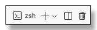

# Lab 1: Application Integration with the Auth0 SDK

[**Table of Contents**](./appdev-workspace.md)

## Synopsis

This lab goes through the steps of integrating an application with Auth0 for authentication and authorization.
This project chooses to use NodeJS as the platform to run a JavaScript web service.
Experienced programmers will have a low learning curve to switch to JavaScript, and it
will be necessary to use JavaScript for the single-page applications anyway.
*Express* is chosen as the embedded web server framework to process HTTP requests in NodeJS.
Express is similar to Flask or FastAPI in Python, Spring in Java, or Kestrel (part of ASP.NET Core) in .NET.
Along the way the features of the Auth0 express-openid-connect SDK will be explored, but
the basic functionality of Auth0 Web Application SDKs is similar across all the frameworks.

## Part 1: Setting Up the Lab

1. Verify the *Explorer panel* is displayed.
The first icon in the toolbar is the *Explorer* icon
,
click this to show and hide the *Explorer* panel.
Ctrl/cmd+shift+E is the keyboard shortcut to open the Explorer panel.

1. Expand the *Module 01/Acme/src* directory.
Right-click the *app.js* file and select *Open to the Side*.
VS Code will split the editor panel and show these instructions on the left, and the app.js file on the right.

1. Locate the *Module 01/Acme* folder in the Explorer.
Right-click the word *Acme* and select *Open in Integrated Terminal*.
This puts the terminal in the correct folder to start with:

    <div style="text-align: center;"></div>

1. In the terminal window
run the *Node Package Manager* command *npm* to install the project dependencies ($ is the prompt).
Do not worry about any warnings from *npm*:
    ```
    $ npm install
    ```

1. If you want a little more room to work in the editor, click the Explorer icon on the toolbar to close that panel.
This should be a satisfactory working environment if your display supports 1920x1080 (regular HD) or higher.

## Part 2: Registering the Auth0 Application

1. In your browser open the dashboard for your Auth0 tenant.
If it is already open, just go to that tab.

1. In the *Navigation Sidebar* at the left of the dashboard choose *Applications &rarr; Applications*.

1. Click the large blue button that says *+ Create Application*.

1. Call the application *ACME Financial Management*, click on *Regular Web Applications*
for the application type, and click the blue *Create* button:

    <div style="text-align: center;"></div>

1. On the application configuration page click the *Settings* tab:

    <div style="text-align: center;"></div>

1. Scroll down to the bottom, expand the *Advanced Settings* section,
and click on the *Grants* tab:

    <div style="text-align: center;"></div>

1. Clear the checkboxes except for *Authorization Code* and *Refresh Token*.
At the bottom of the page click the *Save* button.

## Part 3: Setting the externalized application configuration

1. In the VS Code editor click on the tab opened earlier for the file *app.js*.
New files open in the same editor pane as the file with the focus.

1. In the Explorer panel (open it temporarily if you have to) click the *Module 01/Acme/.env* file to open it next to *app.js*.
This file has externalized configuration variables.
Configuration should not be hardwired into the application, that would require
modifications and rebuilding for each deployment.
The application will read the configuration from this file.

1. Set the ISSUER_BASE_URL property to *https://* plus the value of the application
DOMAIN from the Auth0 tenant.
It will look something like this, but with a different domain name:
    ```
    ISSUER_BASE_URL="https://dev-lab-jmussman-20250506.us.auth0.com"
    ```

1. Copy the values from the application configuration at Auth0 for the CLIENT_ID
and the CLIENT_SECRET and set the corresponding properties in the .env file:
    ```
    CLIENT_ID="..."
    CLIENT_SECRET="..."
    ```

1. Just for your information, the other two environment variables are used this way:
    ```
    SECRET="a long, randomly-generated string stored in env"
    PORT="37500"
    ```

    SESSION_SECRET is used by the *express-session* package (express middleware) to
    encrypt session data that is stored as the session key in the user browser.
    It really does not matter what the value is, just that we externalize it so we can
    randomly change the value whenever we want.

    The TCP/IP PORT number is also externalized so, it can be changed if necessary.
    This is where the application listens on the local host for connections; the public port on the Internet could be something else mapped by a router or firewall.

1. Save the file.
Note, we are not quite done yet because we need to configure the *callback* and
*logout* URLs on the Auth0 side.
But, if you are running in a GitHub Codespace we do not know the URL and port number yet!

## Part 4: Integrating Authentication into the Express Application

1. This application is based on the *Express* framework.
Express is a JavaScript framework for web applications and services that
self-hosts using an embedded web server and processes
requests through a chain of middleware functions.
Fundamentally this is the same architecture used by other modern frameworks:
Java Spring Boot, .NET Core, Python Flask, Rack (Ruby), etc.

1. In the terminal window (still in the module Acme folder)
add the *dotenv* and *epxress-oopenid-connect* (the Auth0 Express SDK) packages
to the project with the following *npm* command:
    ```bash
    $ npm install dotenv express-openid-connect
    ```

1. Go back to the *app.js* file (it is already open).

1. Click on the *app.js* tab in the editor window.
NodeJS packages are downloaded and installed to the *node_modules* folder in the project.
They must be referenced by the application code to use them.
To reference the dotenv module and the Auth0 SDK add the following two import statements
after the existing import statements in *app.js*:
    ```js
    import dotenv from 'dotenv'
    import auth0Express from 'express-openid-connect'
    ```

1. If you are wondering about semicolons in the JavaScript code, technically JavaScript
does not use them (they are ignored).
Many folks still use them as a hangover from C, C++, Java, or C# and you can use them if you like.
This example is following accepted conventions and not including them.

1. *express-openid-connect* is built as a *CommonJS* module and will destructure it
into the components that will be used with the following statement.
*Destructuring* is the JavaScript technique to assign the property values of an object into
individual variables, in this case JavaScript copies the values of the *auth* and *requiresAuth*
properties.
The only reason for doing this is to access the functions *auth* and *requiresAuth* without having
to go through the original object.
Put this right after the imports:
    ```js
    const { auth, requiresAuth } = auth0Express
    ```

1. This application chooses to externalize the configuration values for the connection
to Auth0 in the .env file.
Retrieving the values from the .env file is handled by calling *config* from the *dotenv*
module, so add this statement after destructuring auth0Express:
    ```js
    dotenv.config()
    ```

1. There is a bunch of setup for *Express* following that code that is outside our scope.
A redirect is set up if the request landed here with the wrong URL,
the *Pug* view engine is configured for rendering HTML views with the path to the files, 
middleware components are registered to handle JSON and form processing from requests,
static files are served from the project *public* folder,
and session cookies are enabled and encrypted with the *SECRET* in the .env file with this code (already in the program):
    ```js
    // Use sessions
    app.use(
        session({
            secret: process.env.SECRET,
            resave: false,
            saveUninitialized: false,
            cookie: {
                httpOnly: false,
                sameSite: 'lax',
                secure: false
            }
        })
    )
    ```

1. The Auth0 client object is a middleware function that must be registered with express.
The function is generated by calling the *auth* function from the *express-openid-connect* sdk.
Locate the *app.use(session(...* we just showed you in the last step,
and add this code following that to create it and register the client in one statement:
    ```js
    app.use(
        auth({
            issuerBaseURL: process.env.ISSUER_BASE_URL,
            baseURL: process.env.BASE_URL,
            clientID: process.env.CLIENT_ID,
            clientSecret: process.env.CLIENT_SECRET,
            secret: process.env.SECRET,
            idpLogout: true,
            authRequired: false,
            authorizationParams: {
                response_type: "code"
            }
        })
    )
    ```

    Just FYI it turns out that the *auth* function will load *ISSUER_BASE_URL, BASE_URL, CLIENT_ID*, and *SECRET*
    by default from the environment (process.env).
    The only reason for putting them here is to be clear to anyone reading the code
    what we expect to happen.

    *clientSecret* is not automatically read but necessary for Authorization Code flow.
    *idpLogout* defaults to false, but for customer-facing applications we want users to log out
    of the Auth0 tenant at the same time the log out of our application; when the come back
    they expect to log in again.
    *authRequired* defaults to *true*, but that makes every application endpoint require authentication.
    It is necessary to set *authRequired* as *false* to selectively protect endpoints below.

    The default OAuth authorization flow is *implicit*, which is deprecated and insecure.
    Adding the *response_type: "code"* to the *authorizationParams* configures the client to
    request the *authorization code* grant.

1. The remaining three *Express* middleware registrations are for the three endpoints
*/*, */user*, and */expenses*.
/ should be unprotected, but we need to add the *requiresAuth* middleware to
the other two registrations, so authentication will be required.
Change the registration for */user* to look like this by
adding *requiresAuth* as the
second argument:
    ```js
    app.get("/user", requiresAuth(),  async (req, res) => {
    ```

1. Change the registration for */expenses* to look like this:
    ```js
    app.get("/expenses", requiresAuth(), async (req, res, next) => {
    ```

1. The remaining code in the file configures formatting for HTTP 404 errors.
This must follow
all other middleware because that is how it notices a bad request.
The embedded web server is started by calling the *listen* method.
The data for expenses is at the end of the file; this is just sample data
for testing the application.

## Part 5: Testing the Express Application

1. Open the *Run/Debug* panel from the toolbar 

(the run button with a bug on it).

1. At the top of the Run/Debug panel there is a drop-down box
with a list of *run configurations*.
From this list select *Module 1: Launch ACME FM*.

1. To the left of the run configurations click the run button at the top right.
If there are any errors, fix them and try to launch it again.

    <div style="text-align: center;"></div>

1. When Run/Debug launches the application, it displays a toolbar where the red square may be used
to stop the application.
The run configuration selected launches the app.js file using *nodemon*,
which monitors the application files for changes.
Any changes will cause the application to reload automatically.
You can always restart the application manually with the "recycle" button:

    <div style="text-align: center;"></div>

1. In the *Debug Console* the last line printed out (if the application runs) is a link to
the application landing page.
This link is clickable: hold down the ctrl/cmd key and it to open the landing page.

1. Click the login button at the top right.
The browser will be redirected to the Auth0 tenant authorization server, but
it will display an error because the callback URL is not set.
You can click the link on the page *See details for this error*, and it will show you the callback
URL it does not recognize:

    <div style="text-align: center;"></div>

1. Do not trust the URL that Auth0 display,
the application could have sent the wrong information!
In the *DEBUG CONSOLE* panel in VS Code, find and copy the URL
that you just used to launch the application.
If you are working on the project locally, this will be http://localhost:37500.
If you are in a GitHub Codespace the server will have a random name like "cuddly-journey".

1. In your Auth0 tenant find the application configuration and look at the *Settings* tab.
Scroll down the page until you find the section for *Application URIs*.

    URLs are a subset of URIs.
    Find the *Allowed Logout URLs* and past the URL you just copied in that field:

    <div style="text-align: center;"></div>

1. Just above that you will find the *Allowed Callback URLs*.
Paste the copied URL there too, and then add */callback* to the end of it:

    <div style="text-align: center;"></div>

    Both of these URLs are correct if you are working on your local computer.
    Again, the URL will contain a random name instead of "localhost" if you are working in a GitHub Codespace.

1. Click *Save* and save the changes to the application configuration.

1. Back on the error page that Auth0 is displaying, click the back button to go back
to the application landing page.

1. Click the login button at the top right again.
This time it should work, and you will see the login page.
There is not a user yet to sign in,
so click the link to *Sign up* and create a user for yourself.
Do not use 'Continue with Google', we must create a local user.
You can use any email address and password that you want, it does not have to be real.

    <div style="text-align: center;"></div>

1. If you are working on the project locally, and only then,
an idiosyncrasy of Auth0 is that applications
running are localhost always require consent.
This is to protect users from malware running launching a *phishing application* locally,
developers running applications in a local sandbox just need to live with it.
You will not see this if an HTTPS address to a GitHub Codespace is used.

    <div style="text-align: center;"></div>

1. Once you land on the *Home* page, you can click the username to see the user
details:

    <div style="text-align: center;"></div>

1. When you are finished exploring the application sign the user out with the *Logout* link.

1. Stop the application with red square in the Run/Debug toolbar in VS Code:

    <div style="text-align: center;"></div>

1. Close any open terminal windows.
Look for the trashcan in the terminal tab in the lower panel,
there will be more than one if multiple
terminals are open:

    <div style="text-align: center;"></div>

1. Close any open files except for these instructions.

<br>
Congratulations, you have completed this lab!

When your instructor says you are ready to start the next lab
close any open editor windows besides these instructions, and then follow this
link to the next lab instructions: [**Module 2 Lab**](./module02-instructions.md).

[**Table of Contents**](./appdev-workspace.md)