# Lab 2: API Access Management

[**Table of Contents**](./appdev-workspace.md)

## Synopsis

Now the project is extended to leverage a backend API to get the expenses (and totals).
The API needs to be protected so that only authorized users may access it.

1. Define the backend permissions and map out user access.
1. Set up the backend API configuration at Auth0.
1. Secure the API with access tokens.
1. Obtain and use access tokens in the application.

## Part 1: Define the Acme Backend API and Permissions

Juggling permissions is a three-way negotiation between the API, the identity provider, and
the application.
The API "owns" the permissions; it defines what happens when users present specific permission values.
The identity provider has to define the permission values, and map specific permissions to users.
The application needs to know what permissions to request, and limit the requests a user may make
to the permissions they are granted.

This all must be planned as part of the API development, and the permissions well-defined to configure in the
identity provider.
The only actions the application is looking for right now are the *totals* and *reports*, so here are examples of what we will use for permissions:

* **read:totals**
* **read:reports**

## Part 2: Configure the API in the Auth0 Tenant

1. In the Auth0 tenant use select *Applications &rarr; APIs*.

1. Click the *+ Create API* button to create a new API integration.

1. Name the new API *ACME FM Backend API*, and set the identifier to http://acme-fm-backend-api.
The identifier may be any string, often it is the public URL of the API.
This is also known as the "audience" in the application and the API itself.

    <div style="text-align: center;">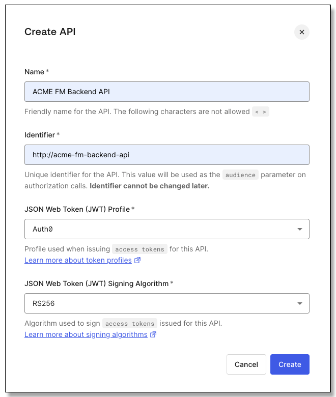</div>

1. Leave the JSON Web Token Profile and the Signing Algorithm as *Auth0* and *RS256*, and
click the *Create* button.

1. The interface lands on the *Quickstart* tab for the new API.
Click on the *Settings* tab; here you can change the name of the API as it appears in the dashboard, the token
expiration, and the profile and signing algorithms.
The assigned ID and the Identifier (audience) cannot be changed.

    <div style="text-align: center;">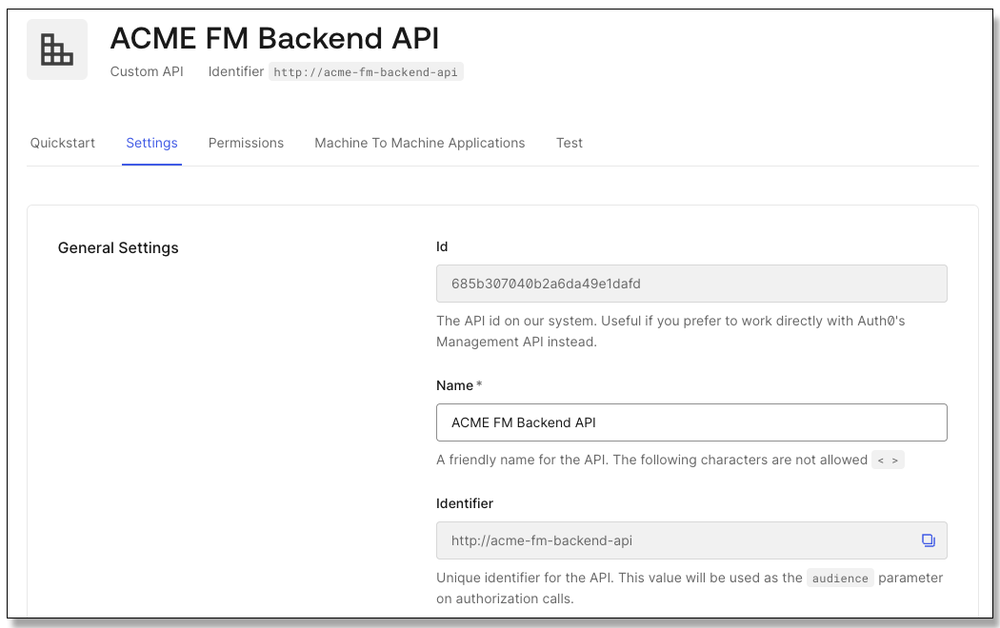</div>

1. Scroll down to *RBAC Settings* enable *Enable RBAC* and *Add Permissions in the Access Token*.

    <div style="text-align: center;">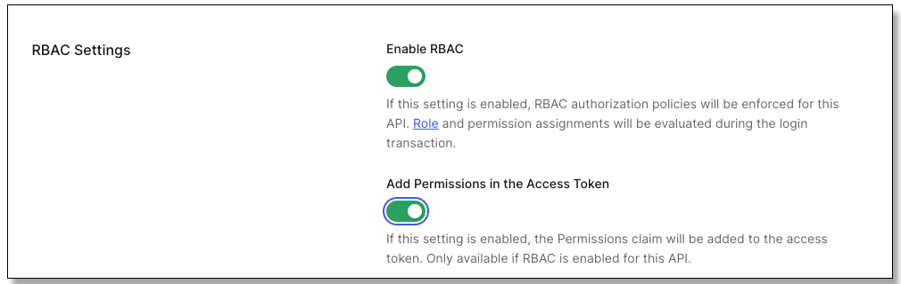</div>

1. Below under *Access Settings* enable *Allow Skipping User Consent* and *Allow Offline Access*:

    <div style="text-align: center;">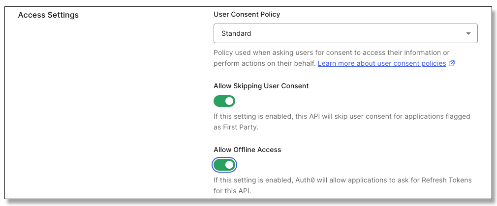</div>

1. Click the *Save* button.

1. Switch to the *Permissions* tab.
Set the first permission to *read:totals* with a description of *Read user expense totals*
and click the *+ Add* button:

    <div style="text-align: center;">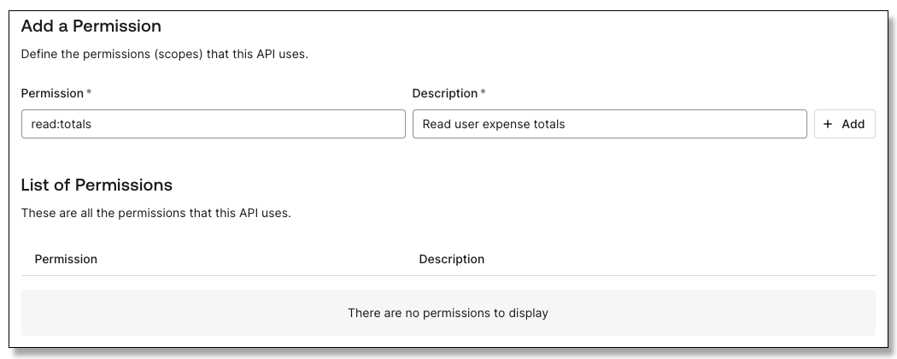</div>

1. Fill in a second permission as *read:reports* and a description of *Read expense reports*, and
click the *+ Add* button.

## Part 3: Use Role-based Access Control (RBAC) to allow user access

Users may be assigned API permissions directly.
Usually users work in groups, and often everyone in the group requires the same access.
Also, users access changes during their lifecycle and roles work like groups.
Users may be added to and removed from roles and gain or loose access as that happens.

1. In the sidebar select *User Management &rarr; Roles*.

1. Click the *+ Create Role* button.
Name the role *ACME FM User Access* and make the description *Access to current user data*,
then click the *Create* button.

    <div style="text-align: center;">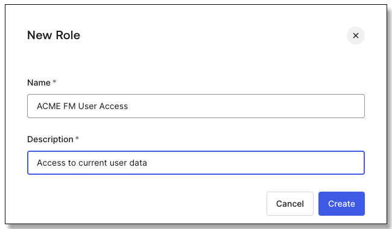</div>

1. The interface lands on the *Settings* tab for the role.
Click on the *Permissions* tab.

1. Click the *Add Permissions* button.

1. Select the *ACME FM Backend API* created in the last section.
Select both permissions, or click the *Select: All* option, then click the
*Add Permissions* button:

    <div style="text-align: center;">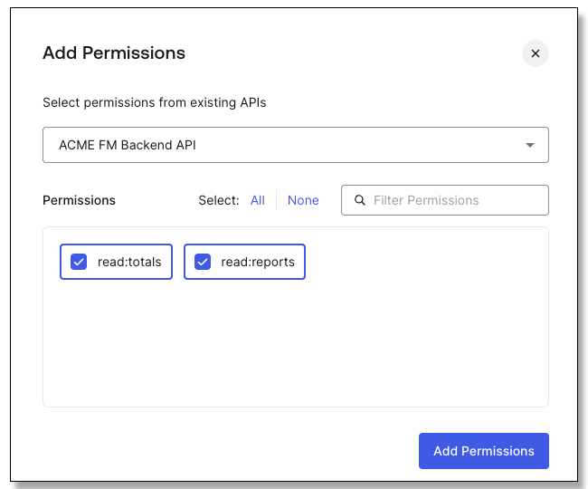</div>

1. User may be assigned to roles here, or roles to users in the user settings,
you can get at it from either direction.
Click the *Users* tab.

1. Click the *Add Users* button, and select a user that requires permission to access their
information in the application.
It is possible to type and select multiple users in this field.

    <div style="text-align: center">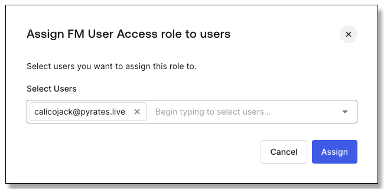</div>

1. Once the user or users have been selected, click the *Assign* button.

## Part 4: Add Access Token Support to the API

Access tokens for APIs must be requested by the application as part of the authorization request.

1. In the VS Code Explorer panel find the API folder and right-click on *.env*.
Choose the *Open to the Side* option.
Notice that the *AUDIENCE*, *ISSUER* and *JWKS_URI* are not set.

1. In the Auth0 tenant use the sidebar to navigate to *Applications &rarr; Applications* and
choose the *ACME Financial Management* application.

1. At the bottom of the settings page, expand *Advanced Settings*, and click on the *Endpoints* tab.

1. Locate the entry for *JSON Web Key Set* and copy the value.

1. In VS Code, in the .env file in the editor, set the *JWKS_URI* to the value copied from the tenant.

1. Set the *ISSUER* to the URL of your Auth0 tenant: *HTTPS&#x200B;://\<your domain>.\<your region>.auth0.com*.
That happens to be the first part of the JWKS_URI value, up to the / in front of the path part of the URL, so you
can get it from there.

1. Set the *AUDIENCE* to the audience we defined in Auth0 for the API: *HTTP&#x200B;://acme-fm-backend-api*.

1. Save the .env file.

1. In the Explorer panel locate the folder "Module 02/API".
Right-click on the folder and choose *Open in Integrated Terminal*.

1. In the new terminal window use *npm* to install the dependency packages:

    ```bash
    $ npm install
    ```

1. Click on the .env file in the right panel just to set the focus.

1. In the Explorer panel find the API folder, expand *src*, and double-click *server.js* to open it.
If you explore this file our focus is on adding authorization; everything else has been provided for you.

1. Open the *Run/Debug* panel from the VS Code toolbar.

1. In the dropdown at the upper right of the panel select the *Module 2: Launch Backend API* run configuration.

1. Click the run button next to the dropdown and launch the API.

1. Use the *View &rarr; Open View...* menu option to open the *Debug Console*.
The successful service start will print the URL to the service; use ctrl/cmd-click to open the landing page for the API.

1. Verify that a landing page for the API is presented with documentation about its endpoints.
Click on an endpoint detail to make sure the application returns JSON data.

    <div style="text-align: center">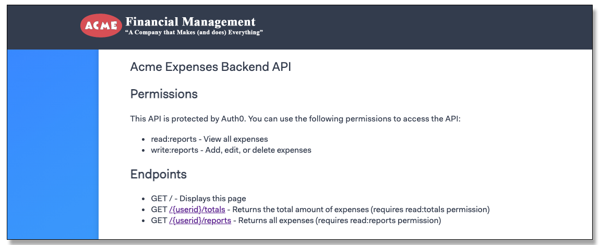</div>

1. In the terminal window add the package for verifying Auth0 access tokens:

    ```bash
    $ npm install express-oauth2-jwt-bearer
    ```

1. In the server.js file add an import statement to get the SDK for verifying Auth0 access tokens:
*auth* is the function that will build the express middleware from the configuration, and
*RequiredScopes* is added to the endpoint middleware to set which scopes are necessary for that endpoint.

    ```js
    import { auth, requiredScopes } from 'express-oauth2-jwt-bearer'
    ```

1. Most of the code in the service is very similar to the application, up to the point where the Auth0
middleware is inserted.
After that is registered the endpoints that follow all require an access token.
Find the endpoint registration for the landing page that starts with *app.get('/'...*.
After the endpoint registration (the end of the function call) register
the Auth0 middleware to require the access token by inserting this code:

    ```js
    app.use(auth({
        audience: process.env.AUDIENCE,
        issuer: process.env.ISSUER,
        jwksUri: process.env.JWKS_URI,
        tokenSigningAlg: process.env.TOKEN_SIGNING_ALG || 'RS256'
    }))
    ```

1. We need to set the scopes for each of the endpoints.
Locate the /totals endpoint beginning with *app.get('/:userid/totals'...*:

    ```js
    app.get('/:userid/totals', (req, res) => {
    ```

1. Change the opening line of the registration by adding *RequiredScopes(),* as the second
argument to *app.get*:

    ```js
    app.get('/:userid/totals', requiredScopes('read:totals'), (req, res) => {
    ```

1. Do the same for the /reports endpoint beginning with *app.get('/:userid/reports'...*:

    ```js
    app.get('/:userid/totals', requiredScopes('read:reports'), (req, res) => {
    ```

1. Make sure the file is saved, and *nodemon* should restart the service automatically.
Remember, you can always restart it manually from the Run/Debug toolbar:

    <div style="text-align: center">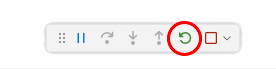</div>

1. From the API landing page make sure following the links to the *totals* and *reports* endpoints are
rejected with a permission problem because you are not providing an access token.
You will see a JSON error message like this:

    ```json
    {"status":401,"message":"Unauthorized"}
    ```

1. Shut down the service with the stop button in the Run/Debug toolbar:

    <div style="text-align: center">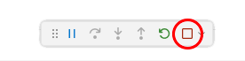</div>


## Part 5: Obtain and Use the Access Token in the Application

This application picks up where Module 01 left off.
We just have to add a request for the token and then
leverage it to make API calls.

1. In the Explorer panel find the *Module 02/Acme* folder, right-click it, and choose *Open in Integrated Terminal"
to get a new terminal window in the correct folder.
Alternatively you could use the current terminal window and issue a *cd ../Acme* command.

1. In the terminal window use *npm* to install the dependency packages:

    ```bash
    $ npm install
    ```

1. In VS Code click on the open *server.js* file to set to focus to the right pane in the editor,
and then in the Explorer panel double-click the *Module 02/Acme/.env file to open it.

1. Set the *CLIENT_ID, CLIENT_SECRET,* and *ISSUER_BASE_URL* as we did in Module 01.
Hint: go find the .env file from Module01 and copy the three values.

1. Set the BACKEND_AUDIENCE to the audience we defined for the API: "*http&#x200B;://acme-fm-backend-api*".

1. Set the BACKEND_URL to the local URL the API will listen on: "http&#x200B;://localhost:38500".
The application is a web application, so the local URL from the application to the API is on the same computer: localhost.

1. Save the file.

1. In the Explorer panel find the *Module 02/Acme/src/app.js* file and double-click to open it.
Hint: if it opens in the left editor panel instead of the right panel, click the tab and drag it to the right panel.

1. Locate the configuration for the Auth0 client that is registered as the Express middleware: *app.use(auth({...*

1. Add the following audience line to the existing *authorizationParams* section.
This configures the application to request a grant for an access token that matches the backend API we configured:

    <pre><code language="js"><span style="color: #aaaaaa;">authorizationParams: {</span><br>&nbsp;&nbsp;&nbsp;&nbsp;<span style="color: red">audience</span>: process.env.BACKEND_AUDIENCE,</code></pre>

    We externalized the audience and URL values for the backend API in the environment.

1. Add this second line to the authorizationParams* section to include the required scopes; *openid, profile,* and *email* must be included
to get the ID token properly:

    ```js
        scope: 'openid profile email read:totals read:reports',
    ```

1. We already added a try...catch to the endpoint for the home page.
You do not have to add this, how you can use fetch to call an API is outside the class scope:
    ```js
    app.get("/", async (req, res) => {
        let locals = { user: req.oidc && req.oidc.user, total: null, count: null }
        if (locals.user) {
            try {
                const apiUrl = `${process.env.BACKEND_URL}/${locals.user.sub}/totals`
                const config = {
                    headers: {
                        'Content-Type': 'application/json',
                        'Accept': 'application/json',
                    }
                }
                const response = await fetch(apiUrl, config)
                if (response.ok) {
                    locals = { ...locals, ...await response.json()}
                }
            }
            catch (error) {
            }
        }
        res.render("home", locals)
    })
    ```
    In the previous iteration of the application the data was embedded, and the calculation of *total* and *count* was
    passed to the *pug* page template.
    Now we will use *fetch* to go get the data from the API.
    If the request is OK the data is passed to *pug*, otherwise the *catch* eats any error and null data is passed to *pug*,
    which causes the page to report the internal error.

    Pay attention to the fifth line: *locals* has been initialized with the user object from the request; this is an object
    that the Auth0 middleware inserts into the request for an authenticated user.
    That "sub" claim from that object is being used as the identification for the user to the API.
    You may say to yourself: "but that value is already in the access token!".
    And you would be correct, but using it as part of the REST request is a double check for the API (it must be the
    same user ID in the request and in the token).

    The Auth0 middleware also puts the access token in the "OIDC" property of the request object; here we go into it to get the access
    token that was issued when the grant request for the backend API was made.
    Note the middleware provides an object named *accessToken* containing the expiration date, etc.
    that itself has the real access token as the *access_token* property.

1. Well, we were not completely truthful!
In order to make the API call you have to pass the access token, that is the whole point of the exercise.
Locate the middleware registration that beings with *app.get("/", async (req, res) => {*, the one we were just looking at above.

1. To send the bearer token add this line to the *headers* in the configuration we were just looking at for
the call to fetch (below 'Content-Type' and 'Accept'):

    ```js
    'Authorization': `Bearer ${req.oidc.accessToken.access_token}`
    ```

    Note the grave accents (`) around the JavaScript template literal (the value); they are not single quotation marks!

1. Locate the registration for the expenses endpoint: *app.get("/expenses", requiresAuth(), async (req, res, next) => {*.
Add the same authorization header we just did in the previous step to the headers in this endpoint as well.

1. In the Run/Debug panel make sure *Launch Module 2: ACME FM* is selected as the launch configuration and launch the program.

1. Sign on to the app with the user from before; this should be the user that has the role with the API permissions.

1. The landing page should show an internal error talking to the API.
The API is not running, we just wanted to make sure the app would launch first and verify the authentication provides the access token!

1. Click the name of the user on the landing page or the user icon at the upper right to
display the user information:

1. Hover over the second badge, the access token, and select *Inspect*:

    <div style="text-align: center;">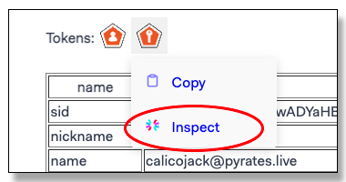</div>

1. This will launch the access token to decipher the contents at *https://jwt.io*.
Check that the permissions claim is in the token and has *read:totals* and *read:expenses*.

1. Close the *jwt.io* tab in the browser.

1. Logout of the application.

1. Stop the application from the Run/Debug toolbar:

    <div style="text-align: center;"></div>

1. In the Run/Debug panel select the configuration "Module 2: Launch All".
This launches two apps at the same time, the backend and the Acme application.
Both show up in the *Call Stack* in the Run/Debug panel:

    <div style="text-align: center;">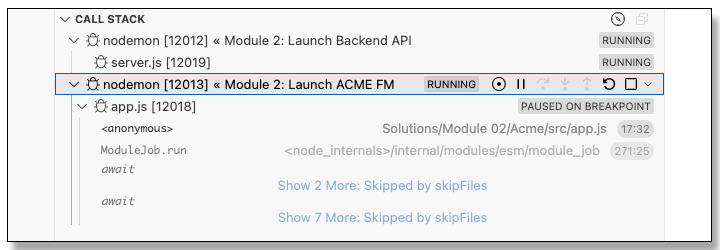</div>

    If you click on a line it will show the output from that app in the *Debug Console*.

    When you hover on a line, it shows the Run/Debug toolbar for that application, so you need to manage
    stopping and restarting each application from this window.

1. Launch the configuration; both the service and the application will launch.
Note: now there are two lines in the Run/Debug Stack window, each with their own toolbar: one for the service and one for the app.

1. Sign on to the application with the same user.
Verify that the after sign-on the total and count is displayed for the user!

    <div style="text-align: center;">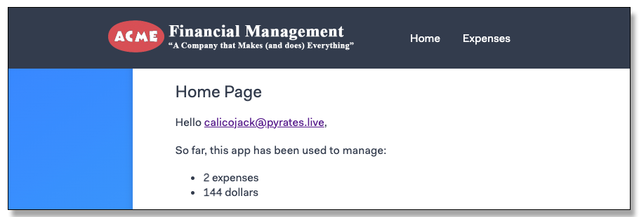</div>

1. Check the *Expense's* page to make sure the API is called to get the expenses.

1. When you are finished exploring the application sign the user out with the *Logout* link.

1. Stop the application with red square in the Run/Debug toolbar in VS Code:

    <div style="text-align: center;"></div>

1. Close any open terminal windows.
Look for the trashcan in the terminal tab in the lower panel,
there will be more than one if multiple
terminals are open:

    <div style="text-align: center;">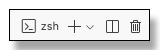</div>

1. Close any open files except for these instructions.

<br>
Congratulations, you have completed this lab!

When your instructor says you are ready to start the next lab
close any open editor windows besides these instructions, and then follow this
link to the next lab instructions: [**Module 3 Lab**](./module03-instructions.md).

[**Table of Contents**](./appdev-workspace.md)