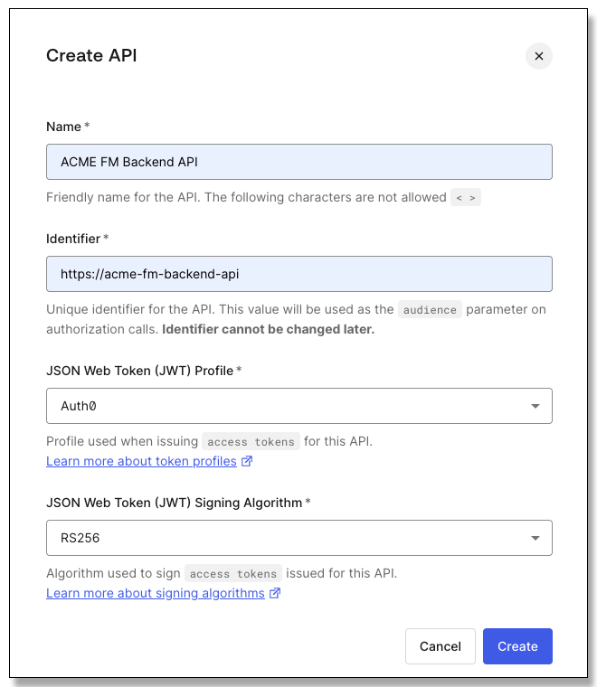

# Lab 2: API Access Management

[**Table of Contents**](./appdev-workspace.md)

## Synopsis

Now the project is extended to leverage a backend API to get the expenses (and totals).
The API needs to be protected so that only authorized users may access it.

1. Define the backend permissions and map out user access.
1. Set up the backend API configuration at Auth0.
1. Secure the API with access tokens.
1. Obtain and use access tokens in the application.

## Define the Acme Backend API and Permissions

Juggling permissions is a three-way negotiation between the API, the identity provider, and
the application.
The API "owns" the permissions; it defines what happens when users present specific permission values.
The identity provider has to define the permission values, and map specific permissions to users.
The application needs to know what permissions to request, and limit the requests a user may make
to the permissions they are granted.

This all must be planned as part of the API development, and the permissions well-defined to configure in the
identity provider.
The only actions the application is looking for right now are the *totals* and *reports*, so here are examples of what we will use for permissions:

* **read:totals**
* **read:reports**

## Configure the API in the Auth0 Tenant

1. In the Auth0 tenant use select *Applications &rarr; APIs*.

1. Click the *+ Create API* button to create a new API integration.

1. Name the new API *ACME FM Backend API*, and set the identifier to http://acme-fm-backend-api.
The identifier may be any string, often it is the public URL of the API.
This is also known as the "audience" in the application and the API itself.

    <div style="text-align: center;"></div>

1. Leave the JSON Web Token Profile and the Signing Algorithm as *Auth0* and *RS256*, and
click the *Create* button.

1. The interface lands on the *Quickstart* tab for the new API.
Click on the *Settings* tab; here you can change the name of the API as it appears in the dashboard, the token
expiration, the profile and signing algorithms.
The assigned ID and the Identifier (audience) cannot be changed.
Under *RBAC Settings* choose *Enable RBAC* and *Add Permissions in the Access Token*:

    <div style="text-align: center;"></div>

1. Under *Access Settings* enable *Allow Skipping User Consent* and *Allow Offline Access*:

    <div style="text-align: center;"></div>

1. Click the *Save* button.

1. Switch to the *Permissions* tab.
Set the first permission to *read:totals* with a description of *Read user expense totals*
and click the *+ Add* button:

    <div style="text-align: center;"></div>

1. Set the second permission to *read:reports* and *Read expense reports*, and
click the *+ Add* button.

This completes the API integration.

## Use Role-based Access Control (RBAC) to allow user access

Users may be assigned API permissions directly.
Usually users work in groups, and often everyone in the group requires the same access.
Also, users access changes during their lifecycle and roles work like groups.
Users may be added to and removed from roles and gain or loose access as that happens.

1. In the sidebar select *User Management &rarr; Roles*.

1. Click the *+ Create Role* button.
Name the role *ACME FM User Access* and make the description *Access to current user data*,
then click the *Create* button.

    <div style="text-align: center;"></div>

1. The interface lands on the *Settings* tab for the role.
Click on the *Permissions* tab.

1. Click the *Add Permissions* button.

1. Select the *ACME FM Backend API* created in the last section.
Select both permissions, or click the *Select: All* option, then click the
*Add Permissions* button:

    <div style="text-align: center;"></div>

1. User may be assigned to roles here, or roles to users in the user settings,
you can get at it from either direction.
Click the *Users* tab.

1. Click the *Add Users* button, and select a user that requires permission to access their
information in the application.
It is possible to type and select multiple users in this field.

    <div style="text-align: center"></div>

1. Once the user or users have been selected, click the *Assign* button.

## Add Access Token Support to the API

Access tokens must be requested by the application.
Only one access token may be requested at a time, multiple requests may be necessary to make requests
to multiple APIs.

1. In the Auth0 tenant use the sidebar to navigate to *Applications &rarr; Applications* and
choose the *ACME Financial Management* application.

1. At the bottom of the settings page, expand *Advanced Settings*, and click on the *Endpoints* tab.

1. Locate the entry for *JSON Web Key Set* and copy the value.

1. In VS Code in the *Explorer* panel open the path to *Module 02/API*.

1. Click on the *.env* file to open it.
Notice that the *AUDIENCE*, *ISSUER* and *JWKS_URI* are not set.
Set the *JWKS_URI* to the value copied from the tenant.

1. Set the *ISSUER* to the URL of your Auth0 tenant: *HTTPS&#x200B;://\<your domain>.\<your region>.auth0.com*.
That happens to be the first part of the JWKS_URI value, up to the / in front of the path part of the URL.

1. Set the *AUDIENCE* to the audience we defined for the API: *HTTP&#x200B;://acme-fm-backend-api*, and
save the .env file.

1. In a terminal window navigate to the API folder and use *npm* to install the dependency packages:

    ```bash
    $ cd "Module 02/API"
    $ npm install
    ```

1. In the API folder expand *src* and open the *server.js* file.
Our focus is on adding authorization; everything else has been provided for you.

1. Open the *Run/Debug* panel from the VS Code toolbar.

1. In the dropdown at the upper right of the panel select *Module 2: Launch Backend API*.

1. Click the run button next to the dropdown and launch the API.

1. Use the *View &rarr; Open View...* menu option to open the *Debug Console*.
The successful service start will print the URL to the service; use ctrl/cmd-click to open the landing page for the API.

1. Verify that a landing page for the API is presented with documentation about its endpoints.
Click on an endpoint detail to make sure the application returns JSON data.

    <div style="text-align: center"></div>

1. In the terminal window add the package for verifying Auth0 access tokens:

    ```bash
    $ npm install express-oauth2-jwt-bearer
    ```

1. In the server.js file add an import statement to get the SDK for verifying Auth0 access tokens:
*auth* is the function that will build the express middleware from the configuration, and
*RequiredScopes* is added to the endpoint middleware to set which scopes are necessary for that endpoint.

    ```js
    import { auth, requiredScopes } from 'express-oauth2-jwt-bearer'
    ```

1. Most of the code in the service is very similar to the application, up to the point where the Auth0
middleware is inserted.
After that is registered the endpoints that follow all require an access token.
Find the endpoint for the landing page, *app.get('/'...*
After that call to *app.get* register
the Auth0 middleware to require the access token by inserting this code:

    ```js
    app.use(auth({
        audience: process.env.AUDIENCE,
        issuer: process.env.ISSUER,
        jwksUri: process.env.JWKS_URI,
        tokenSigningAlg: process.env.TOKEN_SIGNING_ALG || 'RS256'
    }))
    ```

1. We need to set the scopes for each of the endpoints.
Locate the /totals endpoint beginning with *app.get('/:userid/totals'...*
Add the *RequiredScopes* call to register the middleware that rejects the request if
the token does not have the *read:totals* scope:

    ```js
    app.get('/:userid/totals', requiredScopes('read:totals'), (req, res) => {
    ```

1. Do the same for the /reports endpoint beginning with *app.get('/:userid/reports'...*,
except the scope is *read:reports*:

    ```js
    app.get('/:userid/totals', requiredScopes('read:reports'), (req, res) => {
    ```

1. That's it!
Locate and click the restart button in the Run/Debug toolbar that pops up when the service is running.

    <div style="text-align: center"></div>

1. From the API landing page make sure following the links to the *totals* and *reports* endpoints are
rejected because there is no token.
You will see a JSON error message like this:

    ```json
    {"status":401,"message":"Unauthorized"}
    ```

1. Shut down the service with the stop button in the Run/Debug toolbar:

    <div style="text-align: center"></div>


## Obtain and Use the Access Token in the Application

Most of the work is already done in the application from the last lab.
We just have to add a request for the token and then
leverage it to make API calls.

1. In VS Code open the *Module 02/Acme/src/app.js* file.

1. Locate the configuration for the Auth0 client that is registered as the Express middleware: *app.use(auth({...*

1. Add the following audience line to the existing *authorizationParams* section to request a grant for an access token for the backend API:

    ```js
    authorizationParams: {
        audience: process.env.BACKEND_AUDIENCE,
    ```
    We externalized the audience and URL values for the backend API in the environment.

1. Add this line to the authorizationParams* section to include the required scopes; *openid, profile,* and *email* must be included
to get the ID token properly:

    ```js
        scope: 'openid profile email read:totals read:reports',
    ```

1. We already added a try...catch to the endpoint for the home page.
You do not have to add this, it is outside the class scope:
    ```js
    app.get("/", async (req, res) => {
        let locals = { user: req.oidc && req.oidc.user, total: null, count: null }
        if (locals.user) {
            try {
                const apiUrl = `${process.env.BACKEND_URL}/${locals.user.sub}/totals`
                const config = {
                    headers: {
                        'Content-Type': 'application/json',
                        'Accept': 'application/json',
                        'Authorization': `Bearer ${req.oidc.accessToken.access_token}`
                    }
                }
                const response = await fetch(apiUrl, config)
                if (response.ok) {
                    locals = { ...locals, ...await response.json()}
                }
            }
            catch (error) {
            }
        }
        res.render("home", locals)
    })
    ```
    In the previous iteration of the application the data was embedded, and the calculation of *total* and *count* was
    passed to the *pug* page template.
    Now the access token is set up as the bearer token in a request header, and *fetch* is used to go get the data from the API.
    If the request is OK the data is passed to *pug*, otherwise the *catch* eats any error and null data is passed to *pug*.

    Pay attention to the fifth line: *locals* has been initialized with the user object from the request; this is an object
    that the Auth0 middleware inserts into the request for an authenticated user.
    That "sub" claim from that object is being used as the identification for the user to the API.
    You may say to yourself: "but that value is already in the access token!".
    And you would be correct, but using it as part of the REST request is a double check for the API (it must be the
    same user ID in the request and in the token).

    The Auth0 middleware also puts the access token in the "OIDC" property of the request object; here we go into it to get the access
    token that was issued when the grant request for the backend API was made.
    Note the middleware provides an object named *accessToken* containing the expiration date, etc.
    that itself has the real access token as the *access_token* property.

1. In the Run/Debug panel make sure *Module 2: ACME FM* is selected as the launch configuration and launch the program.

1. Sign on to the app with the user from before; this should be the user that has the role with the API permissions.

1. The landing page should show an internal error talking to the API.
The API is not running, we just wanted to make sure the app would launch first!

1. Logout of the application.

1. Stop the application from the Run/Debug toolbar.

1. In the Run/Debug panel select the configuration "Module 2: Launch All".

1. Launch the configuration; both the service and the application will launch.
Note there are two lines in the Run/Debug Stack window, each with their own toolbar: one for the service and one for the app.

1. Sign on to the application with the same user.
Verify that the after sign-on the total and count is displayed for the user!

<div style="text-align: center;"></div>

1. Check the *Expense's* page to make sure the API is called to get the expenses.

1. Sign out.

1. Stop the service and application; you have to click the stop button for each one.

<br>
Congratulations, you have completed this lab!

When your instructor says you are ready to start the next Lab,
Close all the editor windows in the right-side panel, and then follow this
link to the lab instructions: [**Module 3 Lab**](./module03-instructions.md).

[**Table of Contents**](./appdev-workspace.md)