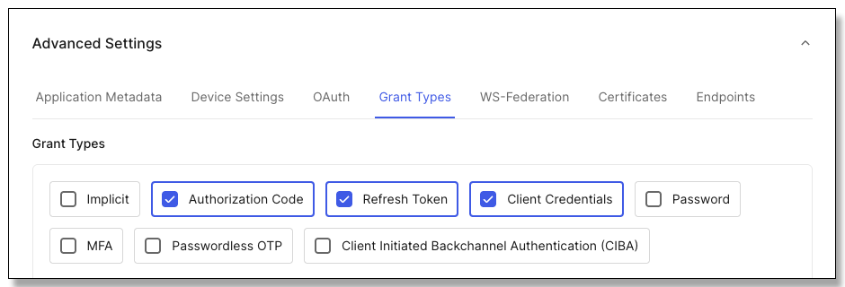
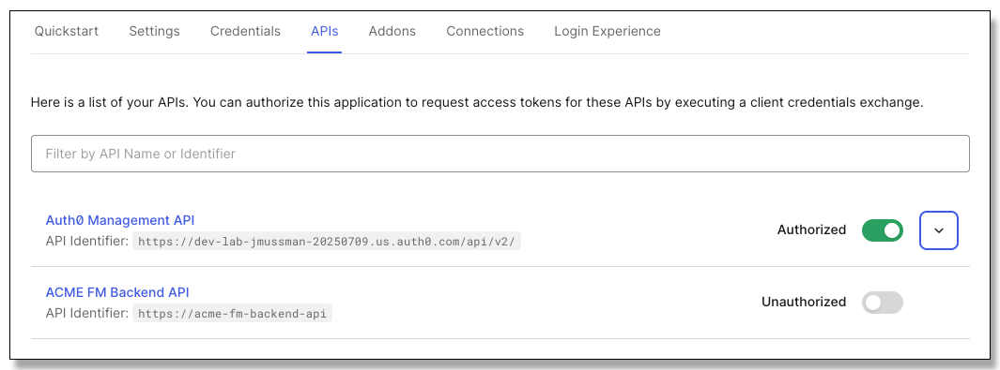
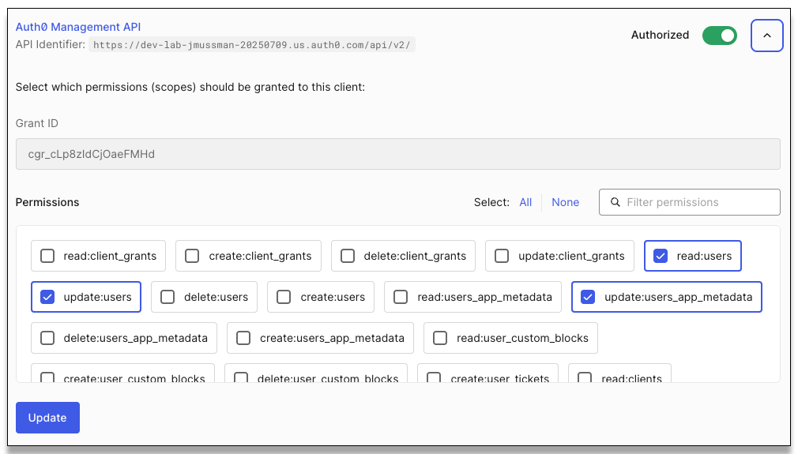

# Lab 4: Management API

[**Table of Contents**](./appdev-workspace.md)

## Dependencies

* The Auth0 ACME Financial Management client configuration from Module 01
* The Auth0 ACME FM Backend API configuration from Module 02
* *certificates/localhost-cert-key.pem* and *certificates/localhost-cert.pem* created in Module 02
* The certificate authority file path in the .env file at the top of the project, created in Module 02
* The Auth0 ACME Financial Management client Private Key JWT configuration from Module 03.
* The Private Key JWT certificates created in Module 03.
* If you relaunch this lab in a new GitHub Codespace update the callback URLs in the Auth0 client configuration.

## Synopsis

Add machine-to-machine functionality to the BFF so can request and access token for the Auth0 Management API
and set/unset the *app_metadata.optin_mfa* property in the user profile.
This page and required functionality has already been added to the Acme front-end application:

<div style="text-align: center"></div>

## Part 1: Link the application integration to the Management API

1. In the Auth0 tenant locate the settings for the *ACME Financial Management* application:
    *Applications &rarr; Applications, Acme Financial Management, Settings*.

1. Scroll down the page and click *Advanced Settings*.
    Select *Client Credentials* if it is not already selected, and click the *Save* button at
    the bottom of the page:

    <div style="text-align: center"></div>

    NOTE: This enables the BFF to use one client ID to both act on the user's behalf and get an access token
    for the backend API, and act on its own behalf and get an M2M client token for the Auth0 Management API.
    In effect, a *hybrid application.*

1. At the top of the page move select the *APIs* tab and enable the *Auth0 Management API*:

    <div style="text-align: center"></div>

    NOTE: This section of the application integration is only used for APIs the application will establish
    a machine-to-machine connection with on its own behalf.
    It has no bearing on issuing access tokens to act on the user's behalf through the Authorization Code
    Grant flow.

1. Expand the *Auth0 Management API* section with the dropdown button at the right.
    The Management API has a significant number of permissions defined.
    Use the *Filter Permissions* search box to find and enable *read:users*, *update:users*, and
    *update:users_app_metadata*.
    Click the *Update* button when all three are selected:

    <div style="text-align: center"></div>

## Part 2: Configure the backend API

1. Right-click the "Module 04/API" folder and open in the integrated terminal.

1. Run *npm install* to install the dependency packages:
    ```bash
    $ npm install
    ```

1. Right-click the "Module 04/API/.env" file and open to the right.

1. Set the *ISSUER* and *JKWS_URI* variables as they were set in the
    "Module 03/API/.env" file.

1. Save and close the .env file.

## Part 2: Add support for requesting the Management API access token

1. Right-click the "Module 04/BFF" folder and open in the integrated terminal.

1. Run *npm install* to install the dependency packages:
    ```bash
    $ npm install
    ```

1. Right-click the "Module 04/BFF/.env" file and open to the right.

1. Set the *CLIENT_ID*, *DOMAIN*, and *ISSUER* variable as they were set
    in the "Module 03/BFF.env" file.

1. Save and close the .env file.

1. Right-click the "Module 04/BFF/src/OpenidClientTokenManager.js" file and open it to the side.

1. At the end of the TokenManager class add this method to
request a new M2M access token:
    ```js
    async getClientAccessToken(audience, scope) {
        let decoded = null
        if (this.clientAccessTokens[audience]) {
            decoded = jwt.decode(this.clientAccessTokens[audience], { complete: true })
        }
        if (!this.clientAccessTokens[audience] || Date.now() >= decoded.payload.exp * 1000) {
            const tokenSet = await client.clientCredentialsGrant(this.issuerConfig, {
                audience: audience,
                scope: scope
            })
            this.clientAccessTokens[audience] = tokenSet.access_token
        }
        return this.clientAccessTokens[audience]
    }
    ```
    NOTE: If the token is already present and good, it is returned.
    If the token is not present or expired, a new token will be requested and returned.
    This is different than requesting a user access token with a refresh token.
    The token is stored using the audience as a key, so multiple tokens may
    be managed in parallel.

1. The *clientAccessTokens* property referenced by the method must be created in the constructor,
    so add this statement to the constructor method at the top of the class:
    ```js
    this.clientAccessTokens = {}
    ```

## Part 3: Leverage the Management API Access token in the BFF

1. In the terminal opened to the BFF folder in Part 2 where npm was used,
add the Auth0 library to the BFF:
    ```bash
    $ npm install auth0
    ```

1. Find and open the "Module 04/BFF/src/server.js" file.
    It should open on the right editor panel because that has the focus, but you can always
    drag it to that panel if it opens on the left.

1. At the top of server.js file add an import to get the ManagementClient class:
    ```js
    import { ManagementClient } from 'auth0'
    ```

1. Locate the following block of code,
the Express registration of the error middleware:
    ```js
    app.use((err, req, res, next) => {
        res.status(err.status || 500)
        res.json({ status: err.status, message: err.message })
    })
    ```

1. Insert this function just above the error middleware registration.
    It provides the proxy between the front-end application and the management API:
    ```js
    app.get('/acme/profile', async (req, res) => {
        try {
            const managementApiToken = await tokenManager.getClientAccessToken(process.env.MANAGEMENT_API_AUDIENCE, process.env.MANAGEMENT_API_SCOPE)
            const idToken = await tokenManager.getIdTokenDecoded(req.session)
            const managementClient = new ManagementClient({ domain: process.env.DOMAIN, token: managementApiToken })
            const response = await managementClient.users.get({ id: idToken?.payload?.sub })
            res.status(200).set({ 'Content-Type': 'application/json'}).send(JSON.stringify(response.data))
        }
        catch (error) {
            res.status(error == 401 ? 401 : 500).send(error == 401 ? 'Authentication required' : 'Internal server error')
        }
    })
    ```

    NOTE: First, get the token to access the management API.
    Second, get the authenticated user ID token to retrieve the *sub* claim, the user ID at Auth0.
    Third, use the Auth0 NodeJS library to create a ManagementClient instance.
    Fourth, use the client to ask the
    management API for the user profile and return the data as JSON.

## Part 4: Run the application

1. If this is in a GitHub Codespace *ONLY*:<br>
    a. Open the "Module 04/Acme/.env" file.<br>
    b. Open the "Module 03/Acme/.env" file.<br>
    c. Copy the VITE_BFF_URL variable and value from the Module 03 file<br>
        and replace the variable in the Module 04 file.<br>
    d. Warning: the URL will change if you are using a new Codespace for Module 04.

1. In the Run/Debug panel select the run configuration "Module 4: Launch All" and launch the three applications.

1. Locate the "CALL STACK" area in the Run/Debug Panel.

1. Click on the *vite* application and look at the *DEBUG CONSOLE* in the lower panel.

1. Find the line where the application prints it is started and provides the link (your link may be different).
    Use the link to launch the Acme application in the browser:
    ```
    The Acme Financial Management application has started, use ctrl/cmd-click to follow this link: http://localhost:37500
    ```

1. Log in as the user from before.

1. Click on the *Profile* link to visit the profile page, it will display the full user profile.
    Do not click the checkbox, that has not been implemented yet!
    If you do click it, the application will have an error.

1. Log out of the Acme application.

1. Terminate all three applications in Run/Debug.

## Part 5: Modify the user app_metadata at Auth0

1. In the server.js file right after the function previously added, put this function to
    use the management API to change *app_metadata*:
    ```js
    app.put('/acme/profile/optinmfa', async (req, res) => {
        if (req.body?.optin_mfa !== true && req.body?.optin_mfa !== false) {
            return res.status(400).send('Bad request')
        }
        try {
            const managementApiToken = await tokenManager.getClientAccessToken(process.env.MANAGEMENT_API_AUDIENCE, process.env.MANAGEMENT_API_SCOPE)
            const idToken = await tokenManager.getIdTokenDecoded(req.session)
            const managementClient = new ManagementClient({ domain: process.env.DOMAIN, token: managementApiToken })
            await managementClient.users.update({ id: idToken?.payload?.sub }, { app_metadata: {optin_mfa: req.body.optin_mfa }})
            res.status(204).send()
        }
        catch (error) {
            res.status(error == 401 ? 401 : 500).send(error == 401 ? 'Authentication required' : 'Internal server error')
        }
    })
    ```

1. As previously launch the "Module 4: Launch All" run configuration, locate the URL for the Acme front-end application
    and visit it.

1. Log in as the user from before.

1. Changing the checkbox will change the *app_metadata* in the profile, which may be seen as the profile refreshes.

1. Sign out of the Acme application.

1. Terminate all three applications in Run/Debug.

1. Close any editor windows in the right-side panel.

1. Close any open terminal windows.

<br>
Congratulations, you have completed this lab!

When your instructor says you are ready to start the next Lab,
Close all the editor windows in the right-side panel, and then follow this
link to the lab instructions: [**Module 5 Lab**](./module05-instructions.md).

[**Table of Contents**](./appdev-workspace.md)