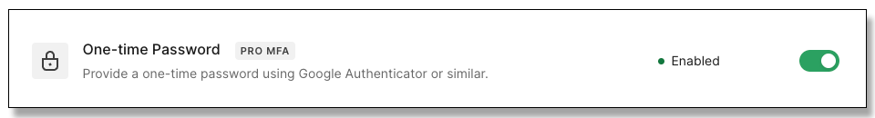
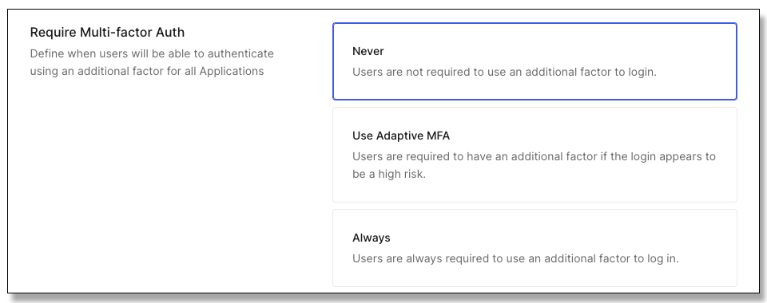
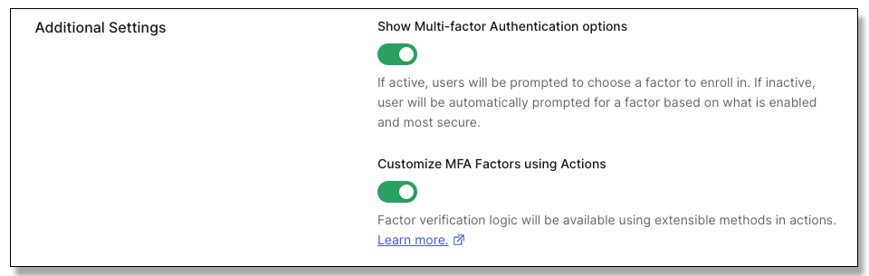
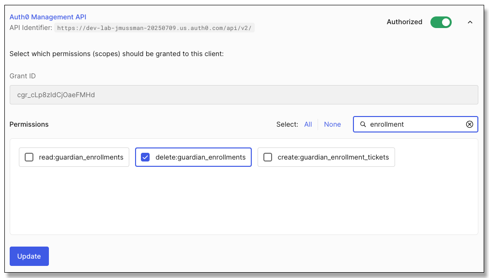
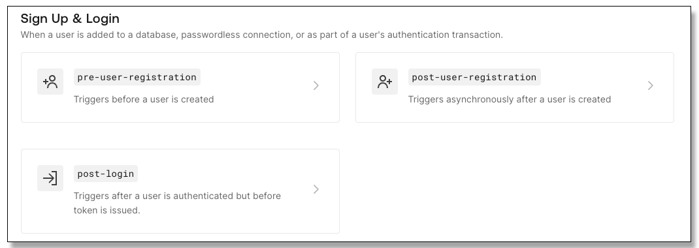
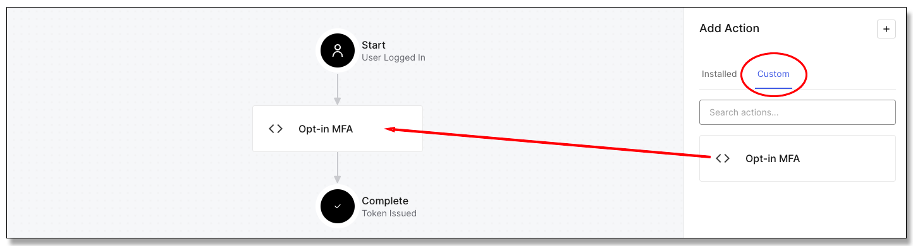
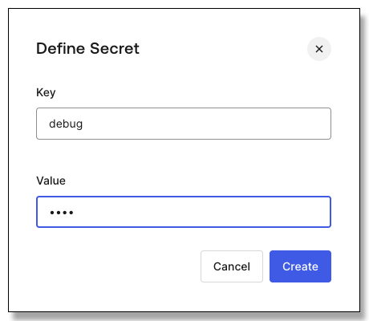
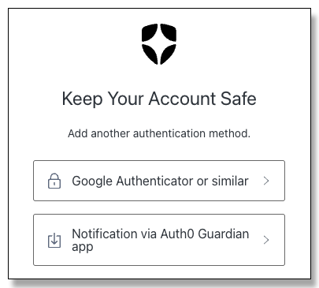
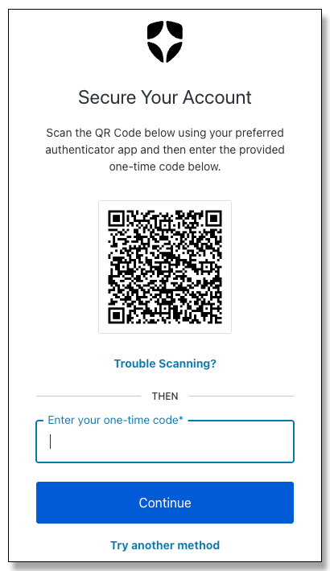
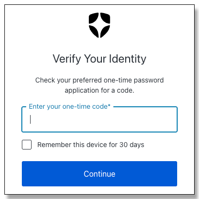

# Lab 5: Triggers and Actions (and MFA)

[**Table of Contents**](./appdev-workspace.md)

## Dependencies

* The Auth0 ACME Financial Management client configuration from Module 01
* The Auth0 ACME FM Backend API configuration from Module 02
* *certificates/localhost-cert-key.pem* and *certificates/localhost-cert.pem* created in Module 02
* The certificate authority file path in the .env file at the top of the project, created in Module 02
* The Auth0 ACME Financial Management client Private Key JWT configuration from Module 03.
* The Private Key JWT certificates created in Module 03.
* The *user_metadata.optin_mfa* profile attribute established in Module 04.
* If you relaunch this lab in a new GitHub Codespace update the callback URLs in the Auth0 client configuration.

## Synopsis

There are generally two choices for customer-facing applications and multifactor authentication: either force
all customers to use MFA, or allow customers to opt-in if they want it.
This lab will expand on the *user_metadata.option_mfa* property in the user profile to trigger MFA enrollment
or enforcement when it is set.
Another link will be added to the *Profile* view to clear MFA enrollment from the user profile
via the Management API.

## Part 1: Enable MFA

1. Use the sidebar to go to *Security &rarr; Multi-factor Auth*.

1. Go down the page and find *One-time Password* and click the toggle button to enable it:

    <div style="text-align: center;"></div>


1. Right below it click the whole box for *Push Notification using Auth0 Guardian*.

1. Click the toggle to enable it.

1. Go back to *Multi-factor Authentication* (the previous page).

1. Scroll down the page to *Part 2 Define Policies*.

1. Make sure *Never* is selected for *Require Multi-factor Auth*:

    <div style="text-align: center;"></div>

1. Click the *Save* button.

1. Scroll down to the bottom and make sure both options are checked for additional settings.
    Without these, actions cannot trigger enrollment or MFA:

    <div style="text-align: center;"></div>

## Part 2: Grant privileges to clear user MFA enrollment

1. Locate the API settings for the application integration with
    *Applications &rarr; Applications, ACME Financial Management, APIs*.

1. Use the drop-down button next to *Auth0 Management API* to show the permissions granted.

1. Search for *enrollment* and grant *delete:guardian_enrollments*:

    <div style="text-align: center;"></div>

1. Click the *Update* button to save the changes.

## Part 3: The Acme Application, BFF, and API

The Acme VUE application has already been modified to show the link to clear enrollments on the *Profile* page.

1. Right-click the "Module 05/API/.env" file and open it to the side.

1. Set the missing environment variables with the values from the Auth0 tenant (hint: go back to the corresponding file in Module 04).

1. Save and close the .env file.

1. Right-click the "Module 05/API" folder and open it in the integrated terminal.

1. Install the depdencies:
    ```bash
    $ npm install
    ```

1. Close the terminal window.

1. Right-click the "Module 05/BFF/.env" file and open it to the side.

1. Set the missing environment variables for "Module 05/BFF/.env".

1. Save and close the .env file.

1. Right-click the "Module 05/BFF" folder and open it in the integrated terminal.

1. Install the depdencies:
    ```bash
    $ npm install
    ```

1. Close the terminal window.

1. Right-click the "Module 05/BFF/src/server.js" file an open it to the side.

1. In server.js near the end of the file locate the following code the Express endpoint registration that the Vue application calls
    to set the *optin_mfa* property:
    ```js
    app.patch('/acme/profile/optinmfa', async (req, res) => { ...
    ```

1. After this registration insert a new endpoint for the Vue application to reset the user MFA enrollment:
    ```js
    app.delete('/acme/profile/resetmfa', async (req, res) => {
        try {
            const managementApiToken = await tokenManager.getClientAccessToken(process.env.MANAGEMENT_API_AUDIENCE, process.env.MANAGEMENT_API_SCOPE)
            const idToken = await tokenManager.getIdTokenDecoded(req.session)
            const managementClient = new ManagementClient({ domain: process.env.DOMAIN, token: managementApiToken })
            const response = await managementClient.users.deleteAllAuthenticators({ id: idToken?.payload?.sub })
            res.status(204).send()
        }
        catch (error) {
            res.status(error == 401 ? 401 : 500).send(error == 401 ? 'Authentication required' : 'Internal server error')
        }
    })
    ```

    NOTE: This is almost identical to the *optinmfa*, except that it responds to the HTTP *DELETE* verb because the enrollment is being deleted,
    and it does not pass any data.

1. If this is in a GitHub Codespace *ONLY*:<br>
    a. Open the "Module 04/Acme/.env" file.<br>
    b. Open the "Module 03/Acme/.env" file.<br>
    c. Copy the VITE_BFF_URL variable and value from the Module 03 file<br>
        and replace the variable in the Module 04 file.<br>
    d. Warning: the URL will change if you are using a new Codespace for Module 04.<br>
    e. Save and close both files.

## Part 4: Launch the applications

1. In the Run/Debug panel select *Module 5: Launch All* as the run configuration.

1. Launch the three applications with the start button.

1. In the Run/Debug Panel under the Call Stack, select the vite application and look on the DEBUG CONSOLE for the URL to open it.

1. Sign on to verify everything is working, then sign out.
    Leave the application running.

## Part 5: Set up the action script

1. In the Auth0 tenant sidebar select *Actions &rarr; Library*.

1. Click the blue *Create Action* button and in the dropdown list pick *Build from scratch*.

1. Set the action name to *Opt-in MFA*.
    Select *Login / Post Login* as the trigger, and pick the recommended version of NodeJS.
    Click the *Create* button to create the action:

    <div style="text-align: center;"></div>

1. Other than the comments this defines a callback function that will be executed post-login:
    ```js
    exports.onExecutePostLogin = async (event, api) => {
    };
    ```

    NOTE: earlier versions of the Auth0 engine kick out JavaScript code without the semicolons, but
    current versions accept that JavaScript does not use semicolons.

    The Action editor is the *Monaco Editor*, the same core editor that Visual Studio Code is built on.

1. Click the *Deploy* button at the upper right.
    This button deploys the action so it can be used in a flow.
    The *Save Draft* button saves the work, but does not deploy it.
    The *Version History* button allows moving between saved versions, and older versions may be deployed in place of a current version.

1. Switch to the *Actions &rarr; Triggers* in the sidebar:

    <div style="text-align: center;"></div>

1. Click the *Custom* tab, locate the *Opt-in MFA* action, and drag it across to place it between the
    *Start* and *Complete* endpoints in the flow:

    <div style="text-align: center;"></div>

1. Click the *Apply* button in the upper right corner.

1. Verify the user can sign-on in the application.
    Sign the user out.

1. Go back to the editor for the action.
    The fast way is to click on the action in the flow between the two endpoints.
    A link will appear on the right that will go directly to the editor.

1. If an action fails for any reason, the sign on flow will terminate with an error.
    The error goes back to the application.
    Insert this line with an undefined variable into the action code:
    ```js
    exports.onExecutePostLogin = async (event, api) => {
        const something = somethingElse
    }
    ```

1. Deploy the action with the *Deploy* button.

1. In the sidebar locate but do *not click* the option for *Monitoring &rarr Action Logs*.
    Right-click the option and open it in a new tab by itself.

1. Try to sign-on as the user.
    The action will fail, and this redirect lands back at the application, look at the address bar in the browser to see it.
    This causes a "Bad request" message on the page:
    ```
    http://localhost:39500/callback?error=access_denied&error_description=somethingElse%20is%20not%20defined
    ```

    Pay close attention.
    This is *not* the URL for the Acme application, this got caught at the BFF!
    You can use the back button once or twice to get back to the Vue application.

1. Check the *Actions Real-Time Logs* you opened in the other tab.
    Nothing is displayed; action failure does not result in a message.

## Part 6: Handling failure gracefully

So there is a choice for failed actions: terminate the flow, or ignore it and go to the next step.

1. Stop the action from crashing out by wrapping the bad code in a try...catch construct:
    ```js
    try {
        const something = somethingElse
    } catch (error) {
        console.log(error)
    }
    ```

1. Deploy the action.

1. Try the sign-on again, it will succeed.
    Check the log output:
    ```
    15:32:32: ReferenceError: somethingElse is not defined
        at exports.onExecutePostLogin (/data/io/node22/e2f39511-1437-45b6-bcbf-8a67ac64acb1/webtask.js:4:23)
        at AsyncLocalStorage.run (node:internal/async_local_storage/async_hooks:91:14)
        at r.runInLogContext (/data/io/6a5421569e84026895230fefdbbfde3dae353df1.js:5:16265)
        at /data/io/6a5421569e84026895230fefdbbfde3dae353df1.js:9:1113
        at process.processTicksAndRejections (node:internal/process/task_queues:105:5)
    ```

    The error was caught, and the flow was allowed to proceed.

1. Sign out of the application.

1. To terminate the flow programmatically add this call on the *api* object to the end of the catch block.
    The first parameter is the *reason*, the second is the detailed *description*.
    But... the action should be careful not to leak any information that details how it works,
    and could be used to compromise it:
    ```js
    api.access.deny('Failure', 'Internal error')
    ```

1. Deploy the action.

1. Try the sign-on, it will fail similar to before but no internal information about the syntax error is revealed:
    ```
    http://localhost:39500/callback?error=access_denied&error_description=Failure
    ```

1. Check the log; the detailed error from the exception was still recorded there.

1. Use the browser back button to go back to the application landing page.

## Part 7: Logging messages

NodeJS offers console.log(), info(), warn(), error(), debug(), assert(), etc.
The actions environment does not differentiate between them, they all get written to the same log.

Generally actions need levels of logging; some messages should always be logged while others may
only be desired during problem debugging.
NodeJS does not provide configurable logging levels.
The only way to enable or disable messages is through flags internal to the action.

Define configurable functions to handle logging and debugging.
    
1. Add these two definitions prior to the try block:
    ```js
    const actionLog = (...args) => console.log('MFA ACTION:', ...args)
    const actionDebug = (...args) => event.secrets.debug  && console.log('MFA ACTION:',' ...args)
    ```

1. In front of the bad statement add a debug message that it is about to be tried:
    ```js
    actionDebug('Attempting bad statement')
    ```

1. Change the console.log in the catch block to use *actionLog*, and take out the api call
    denying authorization:
    ```
    } catch (error) {
        actionLog(error)
    }

1. Deploy the action.
    Wait a few seconds for it to actually deploy, probably at least fifteen.

1. In the log view, use the menu at the top right of the log panel to clear the log.

1. Sign-on to the application.

1. Check the log.
    Only the message from the catch block is displayed:
    ```
    16:04:32: MFA ACTION: ReferenceError: somethingElse is not defined
        at exports.onExecutePostLogin (/data/io/node22/e2dff566-c2b9-4c3a-8ef2-cbac5396ac93/webtask.js:7:23)
        at AsyncLocalStorage.run (node:internal/async_local_storage/async_hooks:91:14)
        at r.runInLogContext (/data/io/6a5421569e84026895230fefdbbfde3dae353df1.js:5:16265)
        at /data/io/6a5421569e84026895230fefdbbfde3dae353df1.js:9:1113
        at process.processTicksAndRejections (node:internal/process/task_queues:105:5)
    ```

1. Sign out of the application.

1. The debugging statement did not show up because the event.secrets.debug property was not defined.
    At the left of the action editor, click the "key" icon on the toolbar.

1. Click the *Add Secret* button.

1. Set the name of the secret to *debug*, and the value to *true*.
    The value is never shown, but is available to the action through *event.secrets*.
    Click the *Create* button to save the key-value pair:

    <div style="text-align: center;"></div>

1. Deploy the action.

1. Sign-on to the application.

1. Check the log, the debugging message will be displayed:
    ```
    16:15:09: MFA ACTION: Attempting bad statement
    16:15:09: MFA ACTION: ReferenceError: somethingElse is not defined
        at exports.onExecutePostLogin (/data/io/node22/f5f45e69-7e29-4365-976c-71ab4baef6f3/webtask.js:7:23)
        at AsyncLocalStorage.run (node:internal/async_local_storage/async_hooks:91:14)
        at r.runInLogContext (/data/io/6a5421569e84026895230fefdbbfde3dae353df1.js:5:16265)
        at /data/io/6a5421569e84026895230fefdbbfde3dae353df1.js:9:1113
        at process.processTicksAndRejections (node:internal/process/task_queues:105:5)
    ```

1. Sign out of the application.

1. Remove the bad statement and the preceding debug statement from the try block.

1. Click the *Save Draft* button.

## Part 8: Handling opt-in MFA

1. Everything will go in the try block.
    Add a log message at the top of the try block to log the action.
    ```js
    actionLog('Opt-in MFA action triggered')
    ```

1. Everything is driven by the optin_mfa metadata in the user profile, add
    this if statement:
    ```js
    if (event.user.app_metadata.optin_mfa) {
    }
    ```

1. In the if statement build a list of the challenge factors that will be supported:
    ```js
    const challengeFactors = [
        { type: 'otp' },
        { type: 'recovery-code' },
        { type: 'push-notification' },
        { type: 'email' },
        { type: 'phone' },
        { type: 'webauthn-platform' },
        { type: 'webauthn-roaming' }
    ]
    ```

1. "email" is not a valid factor for enrollment, so the list of factors for enrollment
    must not have that.
    Add this array filtering after *challengeFactors* to create that list:
    ```js
    const enrollFactors = challengeFactors.filter(x => x.type !== 'email')
    ```

1. Either the user is or is not enrolled.
    If they are not enrolled, trigger enrollment with this if statement:
    ```js
    if (!event.user.enrolledFactors || event.user.enrolledFactors.length === 0) {
        actionDebug('Prompting for user enrollment')
        api.authentication.enrollWithAny(enrollFactors)
    } else {
    ```

1. And complete the "else" part to start a challenge if they are enrolled:
    ```js
    } else {
        actionDebug(`Challenging user`)
        api.authentication.challengeWithAny(challengeFactors)
    }
    ```

1. Deploy the action.

## Part 9: Test the action script

1. In the Auth0 tenant start with the sidebar to find the user you are using for sign-on:
    *User Management &rarr Users, \<your User>*.
    Click the *Details* tab.

1. Scroll down and verify no MFA is enrolled for this user.
    If there is MFA, clear it.

1. Scroll down to the *app_metadata* section.
    If there is an *optin_mfa* property make sure it is set to "false".
    Save the changes.

1. Sign-on to the application.
    The user should sign-on cleanly.

1. Visit the Profile view.
    *app_metadata.optin_mfa* should not be present, or should be set to "false".

1. Click the checkbox to opt-in to MFA; the page will refresh with *app_metadata.optin_mfa* set to "true".

1. Sign out of the application.

1. Sign-on to the application.
    The property in the user profile will trigger MFA enrollment:
    
    <div style="text-align: center;"></div>

1. Choose a factor that works for you and complete the enrollment; this example is using Google Authenticator:
    
    <div style="text-align: center;"></div>

1. Sign off of the application.

1. Sign-on to the application, you will be prompted for MFA:
    
    <div style="text-align: center;"></div>

1. Go to the *Profile* view.

1. Verify multifactor information is in the profile, it will look similar to this:
    ```json
    "multifactor_last_modified": "2025-07-14T16:48:43.273Z",
    "multifactor": [
        "guardian"
    ],
    ```
    ```json
    "multifactor_last_modified": "2025-07-14T16:54:19.524Z",
    ```

1. Click the link to *Reset MFA*.

1. Verify the "multifactor" property is gone, only the "multifactor_last_modified" remains:
    ```json
    "multifactor_last_modified": "2025-07-14T16:54:19.524Z",
    ```

1. Sign out of the application.

1. Sign-on to the application; you will be prompted to re-enroll in MFA.

1. Sign out of the application.

1. Sign-on to the application; you will be prompted to provide MFA.
    
1. Go to the *Profile* view.

1. Uncheck *Opt-in to MFA*.

1. Sign out of the application

1. Sign-on to the application again; now MFA is not required (the enrollment stays in the user account).

1. Sign out of the application.

1. Shut down the three applications in the Run/Debug panel.

1. Close any open terminal panels.

1. Close all the tabs in the right-side editor panel.


<br>
Congratulations, you have completed this lab!

<!--When your instructor says you are ready to start the next Lab,-->
<!--Close all the editor windows in the right-side panel, and then follow this-->
<!--link to the lab instructions: [**Module 6 Lab**](./module06-instructions.md).-->

[**Table of Contents**](./appdev-workspace.md)